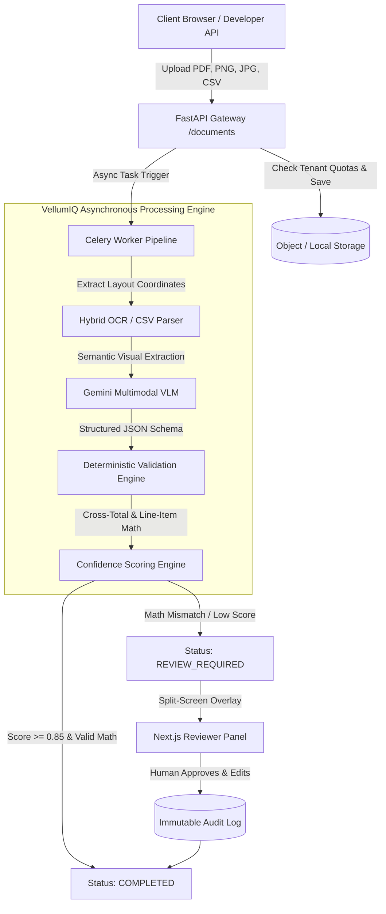

# VellumIQ: Enterprise Multi-Modal Document Intelligence SaaS Platform

[](https://python.org)
[](https://fastapi.tiangolo.com)
[](https://nextjs.org)
[](https://www.typescriptlang.org)
[](https://docs.celeryq.dev)
[](https://opensource.org/licenses/MIT)

> **VellumIQ** is a full-stack, multi-tenant Document Intelligence platform that automates accounts payable and invoice processing. It ingests complex invoices (PDFs, images, CSVs), extracts financial metadata using Multimodal Vision-Language Models (Gemini VLM) and spatial layout OCR, runs deterministic arithmetic validation rules (e.g. Subtotal + Tax - Discount = Total), computes composite confidence scores, and routes error-prone documents to an interactive human-in-the-loop audit reviewer—reducing manual invoice entry time by over 90% while eliminating costly billing errors.

---

## 🌐 Live Production Deployments

* **Live Web Application (Frontend)**: **[https://vellum-iq.vercel.app](https://vellum-iq.vercel.app)**
* **Live API Backend**: **[https://vellumiq.onrender.com](https://vellumiq.onrender.com)**
* **Interactive Swagger API Docs**: **[https://vellumiq.onrender.com/docs](https://vellumiq.onrender.com/docs)**
* **Health & Observability Probe**: **[https://vellumiq.onrender.com/health](https://vellumiq.onrender.com/health)**

---

## 🚀 Key Architectural Capabilities

* **Multi-Tenant Security & Isolation**: Strict organization-level data separation with role-based access control (`admin`, `member`, `reviewer`) enforced across all API routes.
* **Hybrid Ingestion Pipeline**: Accepts PDFs, high-resolution images, and tabular CSV datasets up to 10MB with non-blocking asynchronous Celery worker processing.
* **Spatial OCR & Layout Parsing**: Reconstructs horizontal word baselines, sequences reading order, and extracts bounding-box coordinates using `pdfplumber` and `PyMuPDF`.
* **Multimodal Visual Reasoning**: Leverages Google Gemini Multimodal Vision API to parse complex, non-standard layouts into strict structured Pydantic schemas.
* **Deterministic Arithmetic Validation**: Verifies 5 core business invariants (grand totals, line item multiplications, line item sums, and chronological date sanity) within an absolute tolerance threshold of $\pm 0.05$.
* **Composite Confidence Scoring**: Calculates overall document and field-level confidence scores based on OCR metrics and validation results. Discrepancies receive an arithmetic penalty ($0.5\times$) routing files to `REVIEW_REQUIRED`.
* **Human-in-the-Loop (HITL) Split-Screen Reviewer**: A Next.js 14 review panel enabling accountants to inspect highlights, modify fields, and generate an immutable audit trail.
* **Developer API Keys & Headless Ingestion**: SHA-256 hashed API key authentication for external accounting software, CLI tools, and automated scanners via the `X-API-Key` header.
* **Usage Quota & Tiered Billing**: Monthly page usage tracking with tiered quotas (`FREE`, `GROWTH`, `ENTERPRISE`) and Stripe checkout / webhook integration.
* **Production Observability**: Structured JSON logging (`logging_config.py`) and health metrics tracking database connectivity, storage engine state, and system version.

---

## 🏗️ System Architecture



---

## 🛠 Tech Stack

| Layer | Technology |
| :--- | :--- |
| **Frontend UI** | Next.js 14 (App Router), React 18, TypeScript, Tailwind CSS, Lucide Icons, Axios |
| **Backend API** | Python 3.11, FastAPI, Pydantic v2, SQLAlchemy 2.0 (Async), Alembic |
| **Task Queue** | Celery 5.4, Redis (with Eager local fallback mode) |
| **Document Processing** | `pdfplumber`, `PyMuPDF` (Fitz), `google-genai` (Gemini SDK), `csv.DictReader` |
| **Database** | PostgreSQL (Production), SQLite / `aiosqlite` (Testing & Zero-Cost Cloud Deployment) |
| **Storage** | AWS S3 / MinIO (S3-Compatible) & Local File Storage Engine |
| **Testing** | Pytest, `pytest-asyncio`, HTTPX |
| **Cloud Hosting** | Render.com (Backend Web Service) & Vercel (Frontend Edge) |

---

## 📂 Codebase Directory Structure

```text
├── backend/
│   ├── app/
│   │   ├── api/v1/          # Multi-tenant REST endpoints (auth, docs, validation, review, billing)
│   │   ├── core/            # App settings, DB engine, security, storage clients, JSON logging
│   │   ├── models/          # SQLAlchemy async database entities
│   │   ├── schemas/         # Pydantic schemas (auth, invoice extractions, OCR, validation)
│   │   ├── services/        # OCR engines (PDF & CSV), Gemini VLM, validation, confidence scoring
│   │   ├── tasks/           # Celery asynchronous parsing pipelines
│   │   └── tests/           # 20 integration tests (100% pass rate)
│   ├── requirements.txt
│   ├── .python-version      # Target runtime (3.11.9) for cloud build compatibility
│   └── .env.example
├── frontend/
│   ├── src/
│   │   ├── app/             # Next.js 14 App Router (dashboard, reviewer, settings, auth)
│   │   ├── components/      # Drag & Drop Uploader, Status Badges, Navigation Sidebar
│   │   ├── context/         # AuthContext with tenant session management
│   │   ├── services/        # Axios API clients with dynamic cloud URL resolution
│   │   └── types/           # TypeScript interface definitions
│   ├── package.json
│   ├── tsconfig.json
│   └── next.config.mjs
└── README.md
```

---

## ⚡ Quickstart Guide (Local Development)

### 1. Backend Setup

```bash
cd backend
python -m venv .venv
source .venv/bin/activate  # On Windows: .venv\Scripts\activate
pip install -r requirements.txt
cp .env.example .env
```

Start the FastAPI application:
```bash
python -m uvicorn app.main:app --reload --port 8000
```
* API runs at `http://localhost:8000`
* Swagger docs available at `http://localhost:8000/docs`

---

### 2. Frontend Setup

```bash
cd frontend
npm install
npm run dev
```
* Client console runs at `http://localhost:3000`

---

## 🧪 Running Automated Tests

VellumIQ includes a comprehensive integration test suite covering authentication, multi-tenant isolation, PDF & CSV ingestion, arithmetic validation, and Stripe billing:

```bash
cd backend
python -m pytest -v
```

```text
app/tests/test_auth.py::test_signup_user PASSED                          [  5%]
app/tests/test_auth.py::test_signup_existing_user PASSED                 [ 10%]
app/tests/test_auth.py::test_login_user PASSED                           [ 15%]
app/tests/test_auth.py::test_login_invalid_credentials PASSED            [ 20%]
app/tests/test_documents.py::test_upload_document_success PASSED         [ 25%]
app/tests/test_documents.py::test_upload_document_invalid_type PASSED    [ 30%]
app/tests/test_documents.py::test_upload_document_too_large PASSED       [ 35%]
app/tests/test_documents.py::test_get_document_success PASSED            [ 40%]
app/tests/test_documents.py::test_get_document_tenant_isolation PASSED   [ 45%]
app/tests/test_documents.py::test_get_document_extraction_success PASSED [ 50%]
app/tests/test_documents.py::test_get_document_extraction_tenant_isolation PASSED [ 55%]
app/tests/test_documents.py::test_validation_success_and_high_confidence PASSED [ 60%]
app/tests/test_documents.py::test_validation_failure_and_review_required PASSED [ 65%]
app/tests/test_document_human_review_success PASSED                      [ 70%]
app/tests/test_documents.py::test_document_human_review_tenant_isolation PASSED [ 75%]
app/tests/test_documents.py::test_upload_csv_document_success PASSED     [ 80%]
app/tests/test_main.py::test_read_root PASSED                            [ 85%]
app/tests/test_main.py::test_health_check PASSED                         [ 90%]
app/tests/test_saas.py::test_api_keys_crud_and_auth PASSED               [ 95%]
app/tests/test_saas.py::test_saas_stripe_webhook_and_page_quotas PASSED  [100%]

======================= 20 passed in 44.08s =======================
```

---

## 📜 License

Distributed under the MIT License. See `LICENSE` for more information.
